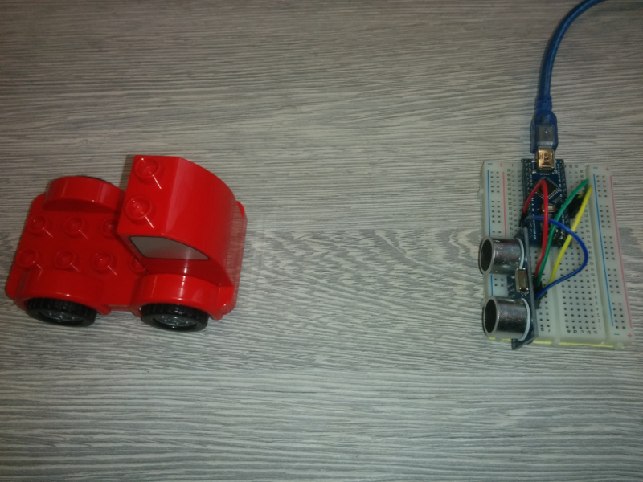

# UltrasonicRadar
Arduino based radar for measuring speed of an object with ultrasonic sensor (CodeWeek workshop for children).

## How does it work?

Ultrasonic sensor is measuring distance on two time points (delayed by approx 200 ms). If object is moving, it computes its speed in km/h.

Speed is printed only if object distance from the sensor is less than 0.5 m and if object has moved for at least 1 cm. Application prints distance of an objet, if object is approaching or moving away and its speed.

## Materials needed
1. 1 x Arduino Nano
2. 1 x HC-SR04 Ultrasonic distance sensor

